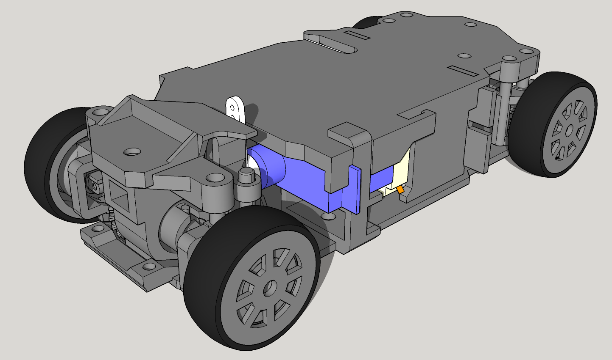

# zcar2

ほぼ全パーツ3Dプリント製の4WD RCドリフトカー。1:28スケール、ホイールベース90mm（M）のMINI-Zシェルに対応\*。

\*注意: シャシーのフロント部分が比較的高いため、RX-7 FDなど一部のシェルには適合しません。AE86シェルでの動作を確認済みです。

テスト走行: https://youtu.be/90DoZpYbfy4

ユニバーサルジョイント クローズアップ: https://youtu.be/g_EzM2HMQvg

このデザインにはプリント難易度の高いパーツが含まれています。挑戦する前にプリンターのキャリブレーションが十分であることを確認してください。

## 特徴

- 4輪独立スライド式サスペンション
- プリント製ユニバーサルジョイントによる4WD駆動（デフなし）
- バッテリーとモーターをミッドマウント配置 — 前後重量配分は約50:50
- ドリフト向けパラレルステアリングジオメトリー
- 一般的なM3ネジ類を使用、すべてロックナット
- TPUプリントタイヤ

## プリント以外の必要パーツ

| パーツ                             | 数量 | 備考                                                                                                                         |
| ---------------------------------- | ---- | ---------------------------------------------------------------------------------------------------------------------------- |
| M3x10mm ボタンヘッドスクリュー     | 8    |                                                                                                                              |
| M3x8mm ボタンヘッドスクリュー      | 7    |                                                                                                                              |
| M3x12mm ボタンヘッドスクリュー     | 1    |                                                                                                                              |
| M3x18mm ボタンヘッドスクリュー     | 1    |                                                                                                                              |
| M3 ロックナット                    | 17   |                                                                                                                              |
| MR105 ベアリング                   | 8    |                                                                                                                              |
| 130サイズ ブラシモーター（2S対応） | 1    |                                                                                                                              |
| GH-S37D 3.7gサーボ                 | 1    |                                                                                                                              |
| 圧縮バネ（外径約4mm、長さ約4mm）   | 4    | 柔らかいバネが望ましい。多色ボールペンのリフィル用バネを切って使うとちょうど良い。普通のボールペンのバネは硬すぎるので不可。 |
| Venom Fly 300mAh 2Sバッテリー      | 1    |                                                                                                                              |
| 小型ブラシESC（2S対応）            | 1    |                                                                                                                              |
| 小型ラジオ受信機                   | 1    | 2チャンネル以上。Flysky GR3Eはケースを外せば使用可能。                                                                       |
| MINI-Z シェル（Mホイールベース）   | 1    | 京商 MZQ101 AE86シェルで動作確認済み                                                                                         |

## 組み立て

準備中
